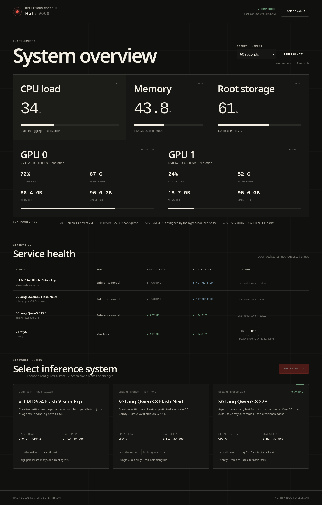

# HAL Dashboard

Repository: <https://github.com/sepffuzzball/hal-dashboard>

FastAPI service that reports local hardware/service status and safely
orchestrates configured LLM / ComfyUI systemd services on the "Hal" machine.
The dashboard is declarative (everything runs from one validated TOML file),
token-authenticated, asynchronous at the API level, and serves its static
frontend (a no-build vanilla HTML/CSS/JS console) from the same origin. The
frontend is bundled inside the package: wheel/sdist installs include
`static/index.html`, `static/styles.css`, and `static/app.js` via setuptools
package data, so an installed package serves the console out of the box.



## Requirements

- Python 3.11+ (stdlib `tomllib` is used for configuration)
- Linux with systemd (the orchestrator shells out to `systemctl`)
- `nvidia-smi` for GPU metrics (optional: GPU data degrades to `null` + reason)
- One machine, one Uvicorn worker, loopback bind

## Setup

```bash
cd hal-dashboard
python3 -m venv .venv
source .venv/bin/activate
pip install -e ".[test]"
```

Generate a strong token and store it in an env file:

```bash
python3 -c "import secrets; print(secrets.token_urlsafe(48))"
cp .env.example .env   # then paste the token into HAL_DASHBOARD_TOKEN
```

For production, the env file must be root-owned and only readable by the
service group (it contains the admin token):

```bash
sudo install -d -m 0755 -o root -g root /etc/hal-dashboard
sudo install -m 0640 -o root -g hal-dashboard .env /etc/hal-dashboard/hal-dashboard.env
sudo install -m 0644 -o root -g hal-dashboard config/systems.toml /etc/hal-dashboard/systems.toml
```

Empty values, tokens shorter than 32 characters (after stripping), and obvious
placeholders (`changeme`, `replace-me`, anything with `__...__`, ...) are
rejected at startup: the app fails closed. `secrets.token_urlsafe(48)` above
comfortably clears the 32-character minimum.

## Running

```bash
source .venv/bin/activate
export HAL_DASHBOARD_TOKEN="$(grep -m1 '^HAL_DASHBOARD_TOKEN=' .env | cut -d= -f2-)"
export HAL_DASHBOARD_CONFIG="$PWD/config/systems.toml"
uvicorn hal_dashboard.main:app --host 127.0.0.1 --port 8787
```

Important: run **exactly one Uvicorn worker and never `--reload`**. The
operation registry and probe cache live in process memory; a second worker
would split them and break the one-mutation-at-a-time guarantee.

## Test / lint

```bash
pytest -q
ruff check .
python -m compileall src tests
```

## Configuration (config/systems.toml)

The full schema is documented inline in `config/systems.toml`. Highlights, all
enforced at startup (`ConfigError` on violation):

- ids: lowercase `[a-z][a-z0-9_-]*`, unique across models and services
- units: plain `*.service` names, unique across models and services
- refresh intervals: every entry of `refresh_choices_seconds` and
  `default_refresh_seconds` must be an integer in the inclusive range
  5..300 (seconds), and the default must be one of the choices; the shipped
  configuration uses `[5, 15, 30, 60, 120, 300]` with a default of `60`
- `conflicts_with` must reference existing services and be declared
  symmetrically on both sides
- gpu indexes: non-negative, no duplicates per entry (configured allocation;
  observed GPU data comes from `nvidia-smi`)
- companion policy is declarative per model: `comfyui_default` (desired
  ComfyUI state after a switch when the caller omits the override) and
  `allow_comfyui_override`; combos that are impossible (`comfyui_default =
  true` or override while conflicting with `comfyui`) are rejected
- `health_url` (optional, plain http(s)) supplements systemd state with an
  HTTP liveness check; it is never exposed to the frontend
- unknown keys are rejected everywhere

## API summary

All endpoints except `GET /api/health` require the header `X-Hal-Token: <token>`
(shared admin token, constant-time compared; no cookies, no query-string auth).
For POST/PUT, a browser `Origin` must exactly match
`HAL_DASHBOARD_ALLOWED_ORIGINS` or the Host-derived same origin. CORS is not
enabled. Responses carry CSP / `X-Frame-Options: DENY` / `nosniff` /
`no-referrer`, and `/api/*` responses are `no-store`.

| Method | Path | Purpose |
| --- | --- | --- |
| GET | `/api/health` | public liveness: `{"status":"ok"}` |
| GET | `/api/config` | sanitized UI config (server info, refresh choices, model/service metadata, capabilities; no paths/units/commands/health URLs) |
| GET | `/api/status` | CPU/RAM/root-disk, per-GPU metrics, service states, active models, conflict warning, active operation; unavailable values are `null` + reason |
| POST | `/api/switch` | `{"model_id": str, "comfyui": bool|null}` → `202 {"operation_id","status_url"}`; validates before touching anything; already-desired topology is a successful no-op |
| PUT | `/api/services/{id}` | `{"active": bool}` for configured auxiliary services only (models go through `/api/switch`); same `202` shape; ComfyUI activation returns `409` while a conflicting model is active |
| GET | `/api/operations/{id}` | queued/running/succeeded/failed, timestamps, current step, sanitized message, step list, final observed states; `404` for unknown ids; the latest 50 operations are kept in memory |

A concurrent mutation returns `409` with `active_operation_id`. Switch order:
snapshot → stop every other model unit and incompatible auxiliary that is not
positively stopped (`inactive`/`failed`; transitional or `unknown` states are
stopped and verified too) → start the selected model (verified active and, if
configured, healthy) → bring ComfyUI to the desired state (verified). A failure triggers
best-effort rollback to the snapshot, then fresh state observation; exit codes
alone are never treated as success. Every `systemctl` call is argv-only with a
bounded timeout through an absolutely-resolved binary; no shell is involved.

## Deployment

1. Create the dedicated unprivileged service user:
   `sudo useradd --system --home-dir /nonexistent --shell /usr/sbin/nologin hal-dashboard`
2. Install the package into a root-owned venv (e.g. `/opt/hal-dashboard/venv`)
   and set up `/etc/hal-dashboard/` as in Setup above.
3. Copy `deploy/hal-dashboard.service` to `/etc/systemd/system/`. Its
   `ExecStart` is the concrete documented install path -
   `/opt/hal-dashboard/venv/bin/uvicorn hal_dashboard.main:app --host
   127.0.0.1 --port 8787 --workers 1` - so the root-owned venv from step 2
   must exist exactly there; keep exactly one worker and no `--reload`. The
   unit keeps the fail-closed root-owned install assumptions: a missing env
   file or a missing/weak `HAL_DASHBOARD_TOKEN` aborts startup.
4. Install the four managed units from `deploy/services/`:
   `vllm-deepseek-v4.service.example`,
   `sglang-qwen38-flash-next.service.example`,
   `sglang-qwen38-27b.service.example`, and `comfyui.service.example` -
   all placeholders must be replaced, then
   `sudo systemctl daemon-reload && sudo systemctl enable --now <unit>`.
5. Install `deploy/polkit/50-hal-dashboard.rules.example` under
   `/etc/polkit-1/rules.d/50-hal-dashboard.rules`, keep the unit list in sync
   with the TOML, then verify the grant:
   `sudo -u hal-dashboard systemctl stop comfyui.service && sudo -u hal-dashboard systemctl start comfyui.service`
6. `sudo systemctl enable --now hal-dashboard` and check
   `systemctl status hal-dashboard` plus `curl -H "X-Hal-Token: ..." http://127.0.0.1:8787/api/status`.

### Shared LLM endpoint identity

The three model backends are mutually exclusive and share ONE external LLM
identity: whichever backend is currently running must bind `127.0.0.1:8000`
and serve the model name `hal-current`. External LLM clients are configured
once - base URL `http://127.0.0.1:8000/v1`, model `hal-current` - and never
need to change across switches. All three `health_url` values in
`config/systems.toml` check `http://127.0.0.1:8000/health`.

No proxy layer is needed precisely because the services are mutually
exclusive: the dashboard stops the previous backend (and verifies it stopped)
before starting the next one, so exactly one service owns port 8000 at any
time; starting a second backend while one is live simply fails its bind. The
service examples under `deploy/services/` set `LLM_PORT=8000` and pass
`--served-model-name hal-current` with `--host 127.0.0.1`; the real venv and
model paths remain intentional placeholders, so the units still fail closed
until replaced.

Ownership protects the setup: the env file (token) is `root:hal-dashboard`
0640; `systems.toml` and the units are root-owned - the service user can never
rewrite what it is allowed to execute.

Adding or renaming a model requires BOTH a `config/systems.toml` change AND a
matching polkit rule update, then `systemctl daemon-reload`, a polkit reload,
and a dashboard restart. Anything the TOML does not declare simply cannot be
touched through the API - there is no arbitrary-unit or arbitrary-command
endpoint.

## Reverse proxy / TLS

The dashboard binds `127.0.0.1:8787` and terminates no TLS itself. If other
machines on the LAN should reach it, put it behind a reverse proxy (nginx,
caddy, ...) that enforces TLS: the shared admin token travels in a header and
would otherwise be sniffable on the wire. Keep the proxy on the same host or
on a trusted network, set `X-Forwarded-Proto`, and add the exact public origin
(`https://hal.lan.example`) to `HAL_DASHBOARD_ALLOWED_ORIGINS` so browser
mutations pass the origin check. Do not enable CORS wildcards.

## Operational and security limitations

- Single shared admin token (no users, no roles, no rotation endpoint); leak =
  full control of the four configured units plus all status data.
- Operations and history are in-memory: a dashboard restart loses the log and
  cannot track an operation that was mid-flight (systemd jobs keep running).
- Exactly one Uvicorn worker; no `--reload`; no multi-node support.
- Status probes are cached/coalesced for ~2 seconds; the dashboard is not an
  event stream.
- Health endpoints (when configured) are the only HTTP egress, with a bounded
  timeout; no URL is exposed to the frontend.
- The polkit grant allows start/stop on the listed units only; if your
  systemd version does not expose the `verb` action detail, the rule fails
  closed (no control) rather than over-granting - verify after installation.
- `nvidia-smi` absence or driver issues surface as `null` + reason fields;
  the dashboard never fabricates zeros.

## License

No license is currently granted. The code is publicly viewable on GitHub, but
all rights are reserved by the owner unless a license file is added later.
This is not open-source software in the licensed sense - see also
[SECURITY.md](SECURITY.md) for how to report vulnerabilities privately.
